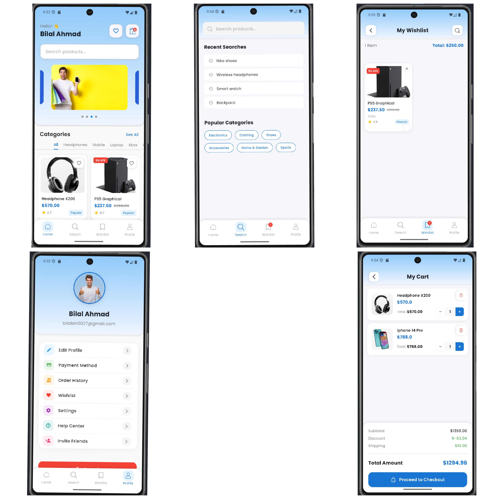
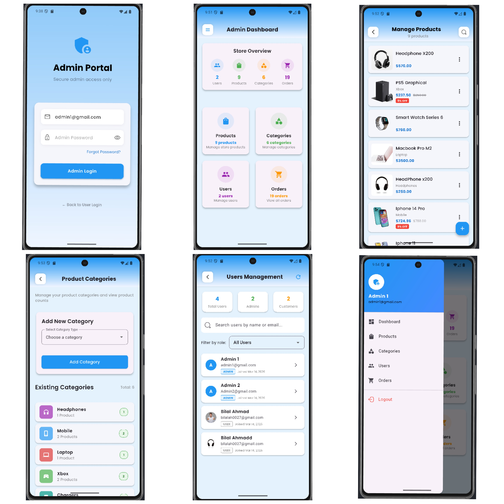
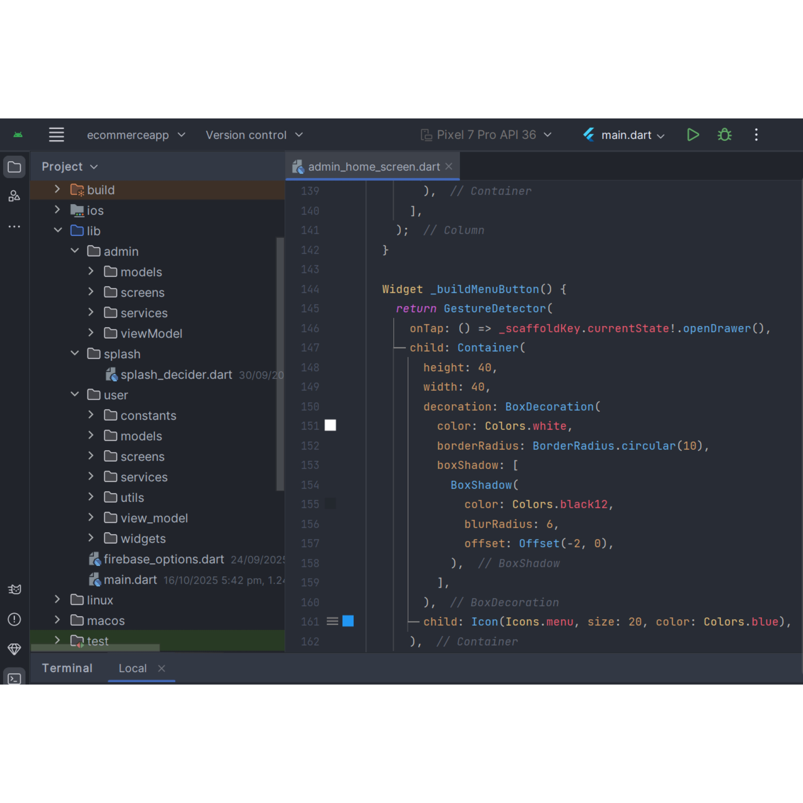

## Smart Pick - E-Commerce App

**Smart Pick** is a Flutter-based mobile e-commerce application that allows 
users to browse products, view details, add items to the cart, and complete 
secure online purchases. The app is designed to provide a smooth and user-friendly
shopping experience for customers.

## Features

- Browse products by category
- View product details with images and description
- Add products to cart and manage cart items
- Secure checkout and payment integration
- User authentication (sign up, login, logout)
- Order history and tracking
- Admin panel can edit and add products easily
- Payment Method
- Cash on Delivery

## Technologies Used

- **Flutter** for front-end
- **Dart** programming language
- **Firebase** for backend and authentication
- **Cloud Firestore** for database
- **Cloudinary** For data saving

## 📸 App Screenshots

### 🎨 Design & Entry
| Splash Logo | Onboarding | Authentication |
| :---: | :---: | :---: |
|  |  |  |

 

### 💳 Core Functionality
| Home Dashboard | Payment Screen |
| :---: | :---: |
|  |  |

### Admin Screen

### Folder Structure

